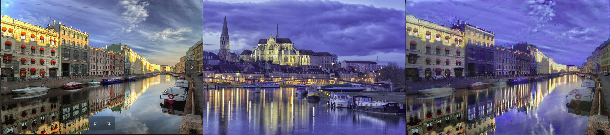
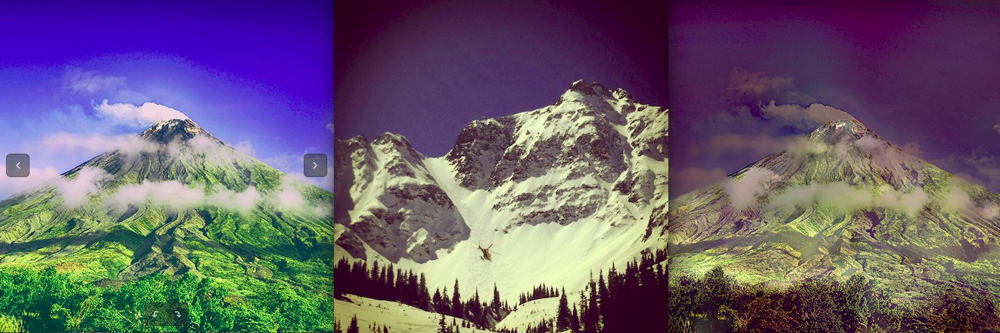

# DeepPhotoStyle_pytorch
Recreating paper ["Deep Photo Style Transfer"](https://arxiv.org/abs/1703.07511) with pytorch.
This project supply semantic segmentation code.
## Here are some experiment results



## Setup
Install [pytorch](https://pytorch.org/) version 0.4.1 with CUDA

```
git clone https://github.com/ray075hl/DeepPhotoStyle_pytorch.git
cd DeepPhotoStyle_pytorch
sh download_seg_model.sh

python main.py --style_image path_style_image --content_image path_content_image
```

## Notice
The semantic segmentation result of image pair(style and content) have a huge impact to the quality of transfered image. Check the segmentation result to see whether the relative semantic of image pair as you expected or not.

## Reference
[1] All the code of semantic segmentation from here [Semantic-segmentation-pytorch](https://github.com/CSAILVision/semantic-segmentation-pytorch). I appreciate this fantanstic project greatly.

[2] Base framework of neural style transfer.  [Neural Transfer with PyTorch](https://pytorch.org/tutorials/advanced/neural_style_tutorial.html)

[3] Compute laplacian matirx. [Closed-form-matting
](https://github.com/MarcoForte/closed-form-matting)

[4] ["Deep Photo Style Transfer"](https://arxiv.org/abs/1703.07511)

[5] Post-processing of photo to photo.[Visual Attribute Transfer through Deep Image Analogy](https://arxiv.org/abs/1705.01088)